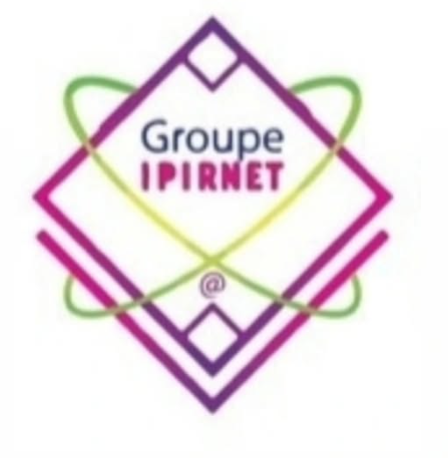

  
  

     

  <h1><strong>End of Studies Project Report</strong></h1>
  <h2><em>Trainee Management System (Section 4.1)</em></h2>

     

  <h3><strong>Realized by :</strong></h3>
  <h3>EL mehdi Bergam</h3>

   

  <h3><strong>Under the supervision of :</strong></h3>
  <h3>Mr. Abdoussi</h3>

     

  
<strong>Institution :</strong> IPIRNET

  
<strong>Academic Year :</strong> 2025/2026

---

## Table of Contents
1. [General Introduction](#1-general-introduction)
2. [Project Context & Objectives](#2-project-context--objectives)
3. [Technologies & Tools Used](#3-technologies--tools-used)
4. [System Architecture & Database](#4-system-architecture--database)
5. [Key Modules & Features Developed](#5-key-modules--features-developed)
6. [User Interface & User Experience (UI/UX)](#6-user-interface--user-experience-uiux)
7. [Conclusion](#7-conclusion)

---

## 1. General Introduction

With the continuous growth of digital transformation in education, administrative tasks require high precision, speed, and reliability. Managing trainees’ data, academic records, and financial statuses manually via paperwork or basic spreadsheets often leads to inefficiencies and data loss. 

This project aims to solve this problem by developing a dedicated and centralized web application for **IPIRNET**. Specifically focusing on section **4.1 (Gestion des Stagiaires)** of the project specifications, this system provides administrators (such as Directors and Secretaries) with an advanced, robust, and highly intuitive tool to oversee all trainee-related activities seamlessly.

## 2. Project Context & Objectives

The primary context of this project is to build an "insanely professional" administrative portal tailored for IPIRNET's workflow. 

**The main objectives are:**
* **Digitize Admissions:** Provide an online form for students to submit applications, putting them into an administrative waiting list.
* **Centralize Records:** Keep track of all trainee data, including their assigned department (Filière) and classes.
* **Track Pedagogy:** Automate the calculation of student averages based on inputted grades and keep strict track of their attendance and internships.
* **Financial Monitoring:** Track the monthly tuition payments (Cotisations) and generate alerts for unpaid fees.
* **Automate Official Documents:** Eliminate manual document writing by generating pixel-perfect, ready-to-print official school documents directly from the database.

## 3. Technologies & Tools Used

To ensure high performance, security, and a premium aesthetic, the following technology stack was chosen:

* **Backend / Server-side:** PHP 8+ 
* **Database Management:** MySQL
* **Database Connection:** PDO (PHP Data Objects) for secure, parameterized queries to prevent SQL injections.
* **Frontend Structure:** HTML5
* **Frontend Styling:** Modern CSS3 featuring advanced attributes like Glassmorphism, custom scrollbars, and customized components (`app.css`).
* **Icons:** FontAwesome v6 for clear and universally recognized interface icons.

## 4. System Architecture & Database

### Application Architecture
The codebase was built with strict separation of concerns to maintain a clean architecture:
* `assets/`: Contains all static files (CSS, JS, Images, Logos).
* `includes/`: Houses core logic such as `db.php` (for database connections) and reusable interface components like `header.php` and `footer.php`.
* **Root Directory:** Contains specific modules for routing and actions (e.g., `moyennes.php`, `absences.php`).
* **Print Components:** Isolated files prefixed with `print_` (e.g., `print_bulletin.php`) dedicated strictly to dynamic document generation.

### Database Design
The relational database, named `gestion_des_stagiaires`, is structured to minimize redundancy and maximize data integrity. Key elements include:
* **Academic Skeleton:** `filieres`, `classes`, and `modules`.
* **People:** `stagiaires` and `demandes_inscription`.
* **Activity Tracking:** `evaluer` (grades), `absences`, `stages` (internships), and `mensualites` (payments).
* **Logging:** `documents_generes` keeps an accurate history of every official document printed by the administration.
* **SQL Views:** Used to intelligently process heavy logic natively within MySQL, such as mathematical grade averages (`v_moyennes_par_module`).

## 5. Key Modules & Features Developed

Based directly on section **4.1 of the specifications**, the system was divided into the following modules:

* **Dashboard & Alerts:** The home screen provides a critical bird's-eye view of total trainees, pending applications, and highlights immediate issues via the `alertes.php` module (such as missing payments or high absences).
* **Admissions System:** 
  * A public-facing candidate form (`inscription.php`) accessible without logging in.
  * An admin queue system (`demandes_inscription.php`) separating candidates from officially enrolled students.
* **Pedagogy Management:** Gives teachers/admins the ability to input grades, track days of absence, and monitor end-of-study projects (PFE) logically separated by student and class.
* **Document Engine:** A comprehensive system that automatically binds student data to official templates, creating:
  * Certificates of Schooling (Certificat de Scolarité)
  * Transcripts & Report Cards (Bulletin / Relevé de notes)
  * Internship Agreements (Convention de Stage)
  * Payment Receipts (Reçu de Paiement)

## 6. User Interface & User Experience (UI/UX)

A primary goal for this project was to establish a **Premium Design**. 
The application departs from standard default styles and instead features:
* **Sidebar Navigation:** A highly organized, permanent side menu for rapid module switching.
* **Modern Aesthetics:** Using carefully selected color palettes, custom typographies (Instrument Serif), and hover micro-interactions.
* **Public vs. Admin Layouts:** The public candidate form is intentionally designed to be clean, simple, and high-contrast, while the admin portal employs a denser, card-based layout suitable for heavy data management.

## 7. Conclusion

This project successfully bridges the gap between traditional paperwork and modern administrative software for **IPIRNET**. By successfully delivering comprehensive features requested in section 4.1—ranging from financial tracking to automated printing of official documents—the final product is an intuitive, secure, and visually stunning web application. 

The modular architecture of the codebase ensures that the application is easily maintainable and highly scalable, laying a strong foundation for future features and digital upgrades at IPIRNET.
